# Lab 0: Eastic Compute Cloud (EC2) Hands-on Lab

Overview
========

Amazon Elastic Compute Cloud (Amazon EC2) is a web service that provides
resizable compute capacity in the cloud. Amazon EC2's simple web service
interface allows you to obtain and configure capacity with minimal
friction. Amazon EC2 reduces the time required to obtain and boot new
server instances to minutes, allowing you to quickly scale capacity,
both up and down, as your computing requirements change. Amazon EC2
changes the economics of computing by allowing you to pay only for
capacity that you actually use.

This lab will walk you through launching, configuring, and customizing
an EC2 web server using the AWS Management Console.

Launch a Web Server Instance
============================

In this example we will launch a Windows Server 2012 R2 instance with
the IIS web server installed upon boot.

1.  Sign into the AWS Management Console and open the Amazon EC2 console
    at <https://console.aws.amazon.com/ec2>.

2.  Click on **Launch Instance**

> 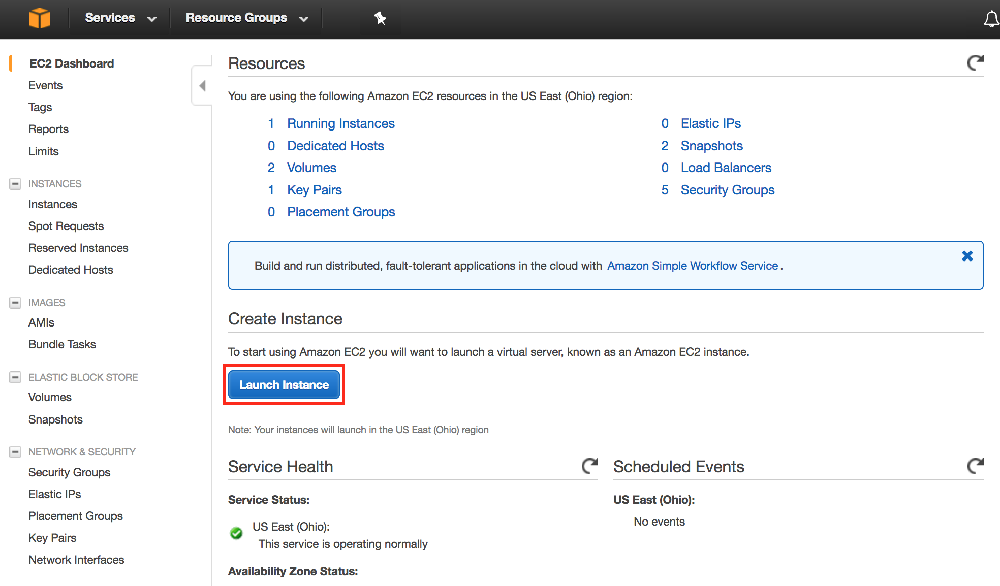

3.  Scroll down and click **Select** on the Windows Server 2012 R2 Base
    AMI.\
    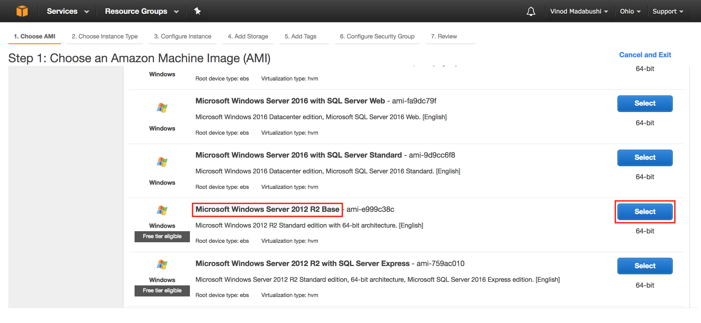

4.  In the **Choose Instance Type** tab, select the **t2.medium**
    instance size and click **Next: Configure Instance Details**

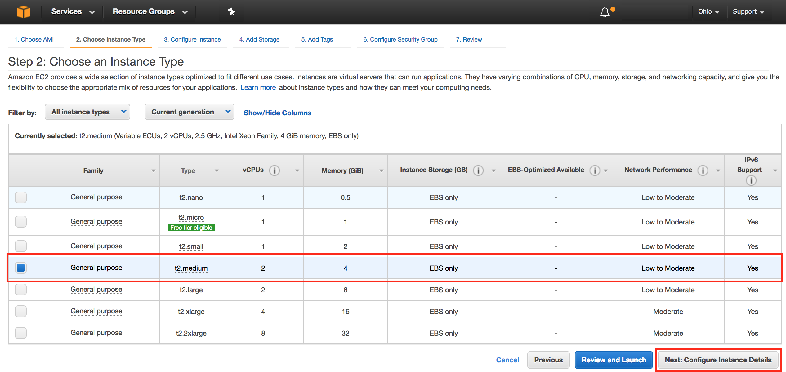

5.  On the **Configure Instance Details** page, expand the **Advanced
    Details** section, copy/paste the script at
    <https://immersionday-labs.s3.amazonaws.com/ec2-windows-lab-userdata.txt>
    into the User Data field (this PowerShell script will install/start
    IIS and deploy a simple web page) and click **Next: Add Storage**:

> 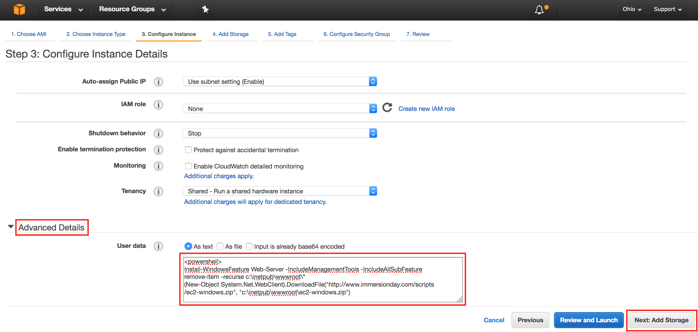
>
> For further information on User Data please refer to the documentation
> at -
> <http://docs.aws.amazon.com/AWSEC2/latest/WindowsGuide/ec2-instance-metadata.html>.
>
>
> On the **Step 4: Add Storage** screen, Click **Next: Add Tags** to
> accept the default Storage Device Configuration and move to the Step
> 5: Add Tags screen.\
> \
> Next, choose a "friendly name" for your instance. This name, more
> correctly known as a tag, will appear in the console once the instance
> launches. It makes it easy to keep track of running machines in a
> complex environment. Name yours according to this format: "\[Your
> Name\] Web Server".\
> \
> Then click **Next: Configure Security Group**.
>
> 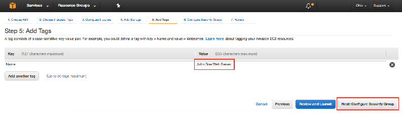\
> For further information on Tags please refer to the documentation at -
> <http://docs.aws.amazon.com/AWSEC2/latest/UserGuide/Using_Tags.html>.

6.  You will be prompted to create a new security group, which will be
    your firewall rules. On the assumption that we are building out a
    Web server, name this security group according to this format
    "\[Your Name\] Web Server", and open ports 3389 and 80. Click the
    **Review and Launch** button after configuring the security group.\
    \
    

7.  Review your choices, and then click **Launch**. *Note the two
    warning boxes at the top of the page, these are to warn you about
    possible configuration issues. In this lab we are creating a Windows
    server that has RDP access that is "open to the world" this is
    something that you wouldn't normally do.*

> 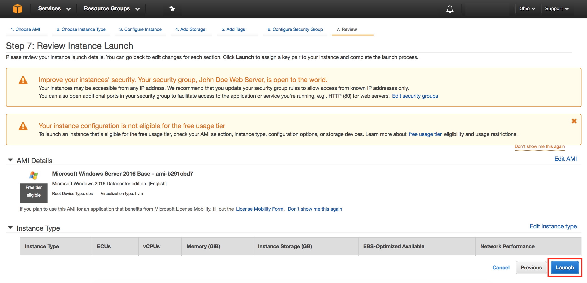
8.  Now you need to create a public/private keypair. When this instance
    launches, you will connect to it via Remote Desktop using the
    credentials for "administrator". For Windows instances, EC2
    automatically generates a password and encrypts with your public
    key. To decrypt the encrypted password, you will use your private
    key. Let's create a new public/private keypair.

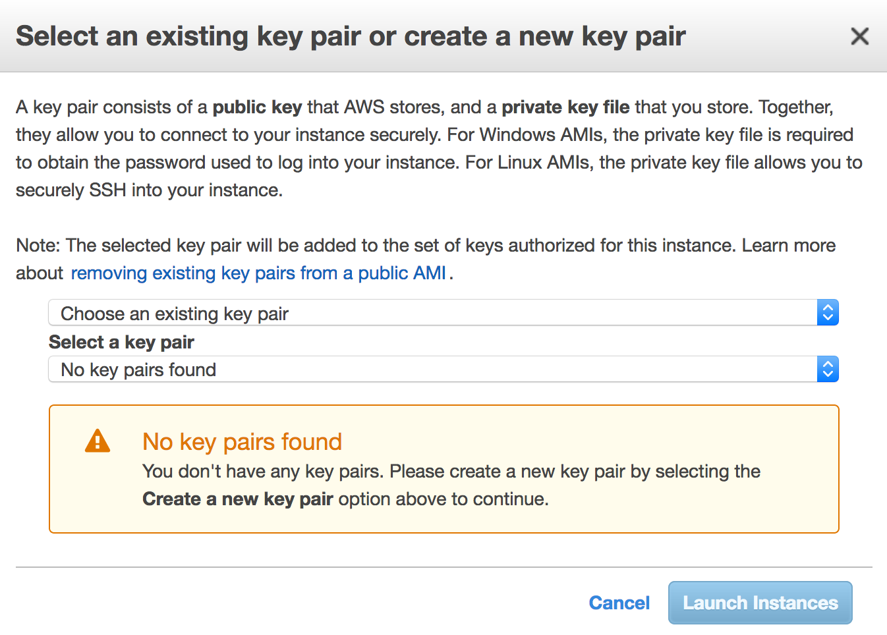

9.  Enter a name for the key pair using the following format:
    \[YourName\]-KeyPair and click **Download Key Pair**.

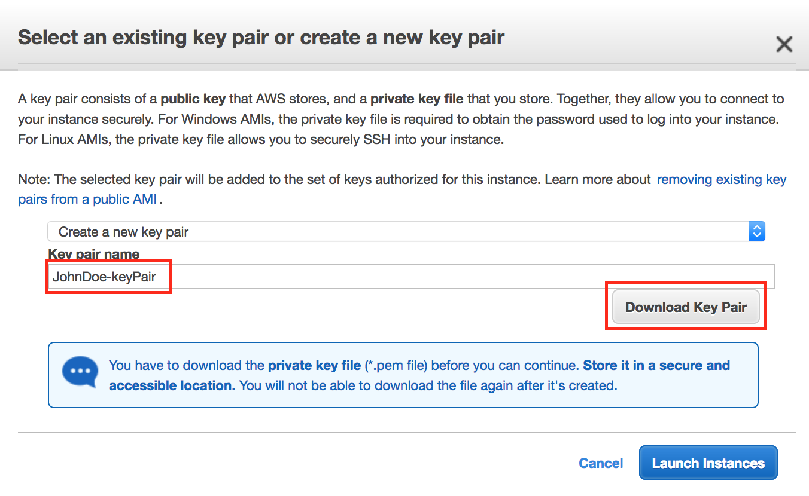

10. Your browser will download the private portion of the key pair to
    your PC. It will have a name like *JohnDoe-KeyPair.pem*. Note the
    location of this file because you will need it later to decrypt the
    administrator password.

11. Now click the **Launch Instances** button to launch your Windows web
    server.

12. The next screen will confirm that your instance is now launching.
    Click the **View Instances** button. Once your instance has
    launched, you will see the "\[Your Name\] Web Server" instance as
    well as the Availability Zone the instance is in and its publicly
    routable DNS name.

> 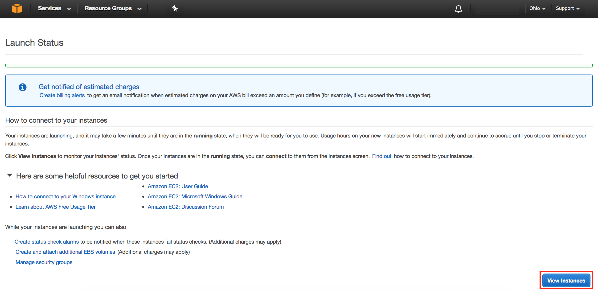

Browse the Web Server
=====================

Now you will browse to the Web Server site that was installed on the
Instance using the PowerShell script defined in the **User Data**
section during creation of the instance.

1.  Wait for the instance to pass the Status Checks. For Windows
    instances, this could take up to 20 minutes.

> 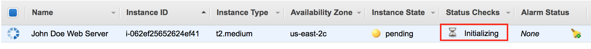

When complete, you will see the Status Checks have passed.

> 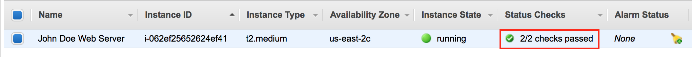
> 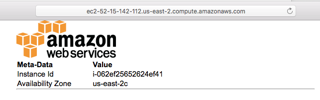

2. Open a new browser tab and browse the Web Server by entering the EC2 instance's Public DNS name into the browser. The EC2 instance's Public DNS name can be found in the console by reviewing the "Public DNS" column. You should see a page that looks similar to this:

Great Job: You have built your first web server!

Connecting To Your Windows Instance
===================================

To connect to the Windows desktop, we will use a RDP client. If you're
using a Windows PC, use the bundled Remote Desktop application. For Mac
users, if you don't have a RDP client already installed, download
[Microsoft Remote
Desktop](https://itunes.apple.com/us/app/microsoft-remote-desktop/id715768417?mt=12&ls=1).

1.  Retrieve the automatically generated, encrypted Windows password by
    right clicking your instance and selecting **Get Windows Password**.

> 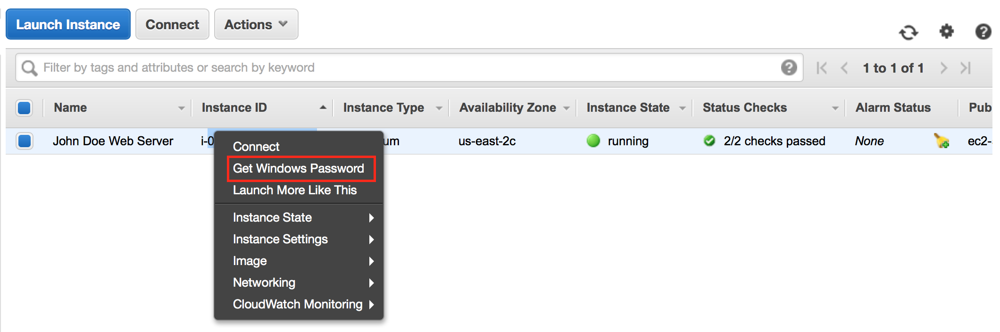

2.  On the next screen, click the Choose File button and select the
    private key file that was automatically downloaded earlier when you
    launched the instance. Then click **Decrypt Password** to obtain the
    Administrator password.

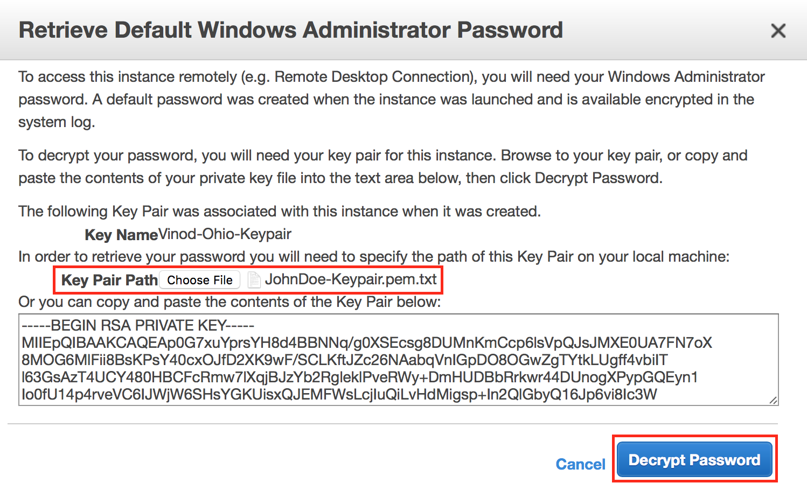

3.  The decrypted Administrator password should look something like
    this:

    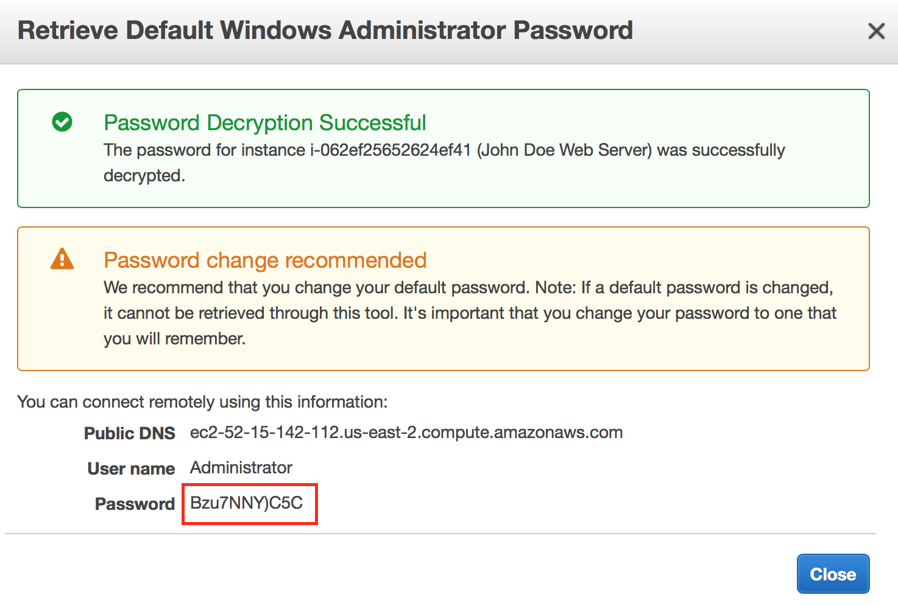

> Note that since only you have the private key, it's important to
> understand the automatically generated password can only be decrypted
> by you. So it's important to keep this key secure. Generally, the
> automatically generated password is changed by the customer after
> first login. If the automatically generated password is not changed
> and the private key is lost, there's no way to recover the password.

4.  Start your RDP application and connect to the hostname of your
    instance. The hostname can be found in a couple of different places.
    For example, in the web console, you'll see hostname listed as the
    **Public DNS** of the instance.

> 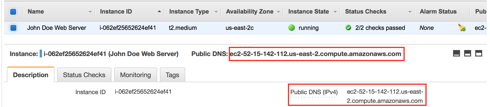

5.  In your RDP application, use **Administrator** as the username along
    with the decrypted password. Once connected, you will have access to
    the Windows desktop. At this point, feel free to explore Windows.
    You should change the Administrator password to something friendlier
    or easy to remember (but still secure of course).

Appendix -- Additional EC2 Concepts
===================================

Change the Instance Type
------------------------

Did you know that you can change the instance type that an AMI is
running on? This is very useful when you need a larger (or smaller) or
perhaps different type of instance to run a workload. This only works
with EBS-backed instances (what we're running here). There is no
particular reason to change the instance type in this lab, but the
following steps outline how easy it is to do in AWS.

1.  In the AWS Console, select your lab instance, then right-click on it
    and hover over **Instance State** and select **Stop** (NOT
    Terminate). Then select **Yes, Stop** to confirm.

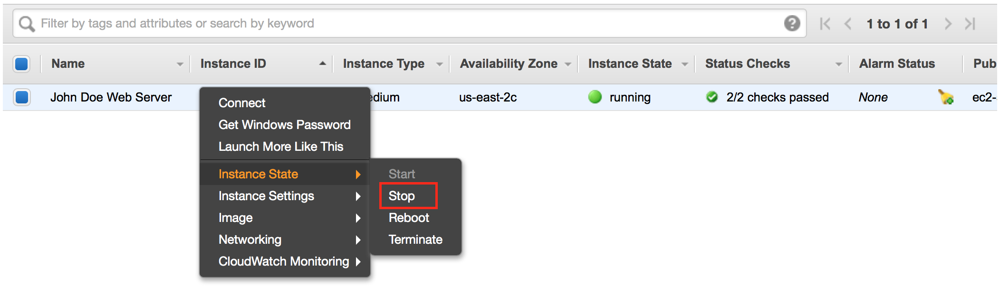

2.  After it has stopped, right-click on it again, hover over **Instance
    Settings** and select **Change Instance Type**.

After going through the options and selecting your new instance type, right-click your lab instance and select Start.
---------------------------------------------------------------------------------------------------------------------

Elastic IPs 
------------

How do you set up practical DNS names for your web server? Using an
address such as http://ec2-75-101-197-112.compute-1.amazonaws.com/ is
cumbersome. Setting up a DNS record that points to
http://www.yourdomain.com is easy enough -- until you reboot the server
and the underlying DNS name and IP address both change.

AWS offers Elastic IP (EIP) Addresses, which are actually NAT addresses
that operate at a regional level. That is, an Elastic IP Address works
across Availability Zones, within a single region.

Assign an EIP to your Web Server as follows:

1.  Sign into the AWS Management Console and open the Amazon EC2 console
    at <https://console.aws.amazon.com/ec2>.

2.  Click on the **Elastic IPs** link in the left hand panel of the AWS
    EC2 Console.

3.  Click **Allocate New Address**, then click **Yes, Allocate** at the
    prompt, then click **Close**.

    We will now associate the address with your Web Server instance. If
    you change instances, it's as simple as allocating the address to
    the new instance.

4.  Select the EIP in the console and then click **Actions \| Associate
    Address**.

5.  In the instance field select the Web Server instance you previously
    created, then click **Associate.**

    You can now create a DNS "A" record in your own DNS server that
    points www.yourdomain.com to the EIP IP Address you created.

> **Two Important Notes:**

1.  As long as an
    > Elastic IP address is associated with a running instance, there is
    > no charge for it. However, an address that is not associated with
    > a running instance costs \$0.01/hour. This prevents address
    > hoarding; however, it also means that you need to delete any
    > addresses you create, or you will incur an ongoing charge.

2.  Load balancing requires CNAME records instead of "A" records. So
    > Elastic IP is not required for load-balanced applications.

Black Belt Booting
------------------

There are a number of advanced techniques that offer additional power
and flexibility when booting instances. For example, some organizations
maintain a series of generic instances, and customize the images upon
launch.

Common techniques include:

-   Automatically check for updates upon each boot.

-   Looking in a well-known location, such as in a S3 bucket, for data
    or a script to tell the instance which packages to load.

-   Pass **User Data** to the instance to accomplish each of the above,
    or possibly instead of the other approaches.

\
For more details on User Data please refer to -
<http://docs.aws.amazon.com/AWSEC2/latest/WindowsGuide/ec2-instance-metadata.html>.
