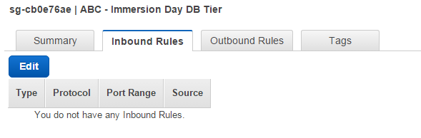
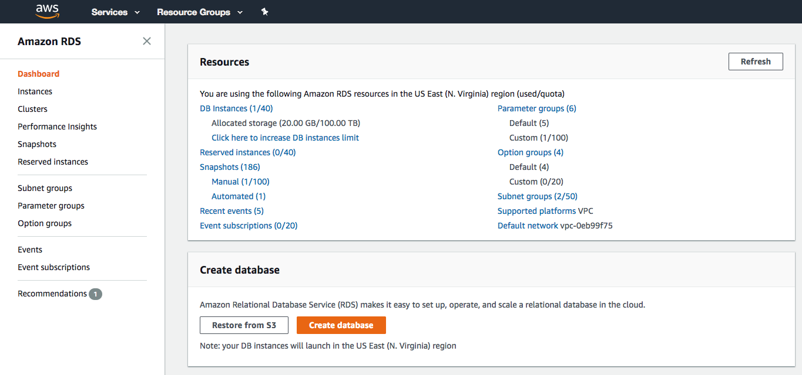
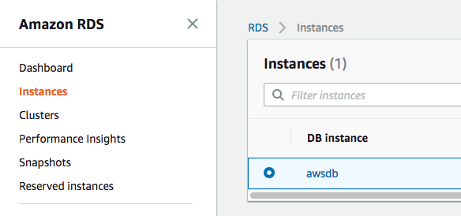

Overview
========

Amazon RDS is a web service that makes it easy to set up, operate, and
scale a relational database in the cloud. It provides cost-efficient and
resizable capacity while managing time-consuming database administration
tasks, freeing you up to focus on your applications and business.

Prerequisite: Setting Up a Web Server Instance to connect to RDS
================================================================

In this example we will launch an Amazon Linux 2 instance, bootstrap
Apache/PHP, and install a basic web page that will display information
about our instance.

Sign into your AWS Management Console and choose EC2 from the Services
menu. [ ]{.underline}

1.  Click on Launch Instance

---------------------------------------------------------

2.  In the **Quick Start** section, select the first Amazon Linux 2 AMI
    and click **Select.**

    
    
3.  In the Choose Instance Type tab, select the t2.micro instance size
    and click **Next**.

4.  On the **Configure Instance Details** page, expand the **Advanced
    Details** section, copy/paste the script below into the **User
    Data** field (this shell script will install Apache & PHP, start the
    web service, and deploy a simple web page). Click **Next.**

+---------------------------------------------------------+
| \#include                                               |
|                                                         |
| https://s3.amazonaws.com/immersionday-labs/bootstrap.sh |
+---------------------------------------------------------+

5.  On this page you have the ability to modify or add storage and disk
    drives to the instance. For this lab, we will simply accept the
    storage defaults and click **Next.**

6.  Here, we choose a "friendly name" for your instance by choosing
    'click to add a Name tag'. This name, more correctly known as a
    **tag**, will appear in the console once the instance launches. It
    makes it easy to keep track of running machines in a complex
    environment. Name yours as: "\[Your Name\] Web Server", and then
    click **Next**.

7.  You will be prompted to create a new security group, which will be
    your firewall rules. On the assumption that we are building out a
    Web server, name your new security group "\[Your Name\] Web Tier",
    and confirm an existing SSH rule exists which allows TCP port 22
    from Anywhere. Click **Add Rule.**:

8.  Select HTTP from the 'Type' dropdown menu, and confirm TCP port 80
    is allowed from Anywhere *(you'll notice, that "Anywhere is the same
    as '0.0.0.0/0')*. Click **Add Rule**.

    

9.  Click the **Review and Launch** button after configuring the
    security group.

10.  Review your cofiguration and choices, and then click **Launch**.

11. Select the key pair that you created in the beginning of this lab
    from the drop-down and check the \"I acknowledge\" checkbox. Then
    click the **Launch Instances** button.

12. Click the **View Instances** button in the lower righthand portion
    of the screen to view the list of EC2 instances. Once your instance
    has launched, you will see your Web Server as well as the
    Availability Zone the instance is in, and the publicly routable DNS
    name.

13. Click the checkbox next to your web server to view details about
    this EC2 instance.

Add a VPC Instance Security Group
=================================

The RDS servers have the same security model as Amazon EC2 overall:
trust nothing. A common use of an RDS instance in a VPC is to share data
with an application server running in an EC2 instance in the same VPC
and that is accessed by a client application outside the VPC. To this
end, we'll need to utilize a VPC security group to allow this access.

Let's create a new VPC security group for our database tier that only
allows traffic from our web tier. In the VPC dashboard, click **Security
Groups**, then the **Create Security Group** button. Set *Name tag* and
*group name* to "\[Initials\] - Immersion Day DB Tier." Write a short
description, and keep the VPC setting to the same VPC you've launched
your EC2 instance in. Then click **Yes, Create**.

After your VPC security group is created, you'll see the details of it
in the lower pane on the screen. Click **Inbound Rules***,* then the
**Edit** button.

Add a new inbound rule for the EC2 server(s) in our web tier. The *type*
should be **MySQL/Aurora (3306)**, the *protocol* **TCP (6),** and in
the *source* box, type the name of the security group to which your EC2
instance belongs. While you're typing, a list of security group(s) that
match that name should be presented to you. Select your security group,
then click the **Save** button.

====================================================================

Launch an RDS Instance
======================

Now that our VPC security group is ready, let's configure and launch a
MySQL RDS Instance.

13. Sign into the AWS Management Console and open the Amazon RDS console
    at <https://console.aws.amazon.com/rds>.

14. Click on **Create database** or **Get Started Now**

> 

15. We will be using a MySQL database, so choose MySQL from the
    available engines.

> **\
> **

16. Check **Only enable options eligible for RDS Free Usage Tier**, at
    the bottom of the page, and then click **Next**. (Note: this is not
    recommended for production databases, as this option will disable
    options such as Multi-AZ deployments or read replicas, but it is OK
    for the purposes of this lab.)

> 

17. Fill out the DB Instance details with the following information and
    click **Next:**

-   DB Engine Version: Use the default engine version ("5.7.22" as of
    August, 2018)

-   DB Instance Class: db.t2.micro

-   Storage Type: General Purpose (SSD)

-   Allocated Storage: 20 GB

-   DB Instance Identifier: awsdb

-   Master Username: awsuser

-   Master Password: awspassword

18. In **Configure Advanced Settings,** fill out *Network & Security*
    with the following information:

-   VPC: Default VPC

-   Subnet Group: default

-   Public Accessibility: No

-   Availability Zone: No Preference

-   VPC Security Group(s): Select *Choose existing VPC security groups*,
    then pick \[Initials\] -- Immersion Day DB Tier

> 

19. Under *Database Options*, enter a DB name called "immersionday" and
    accept the defaults for *database port, parameter group, option
    group* and *IAM DB authentication*. Leave the default options for
    the rest of the configuration groups (*Encryption, Backup,
    Monitoring, Log exports* and *Maintenance*).

-   Review your settings and click **Create database**.

-   In the RDS
    Dashboard, monitor your new DB instance until the status changes
    from "creating" to "backing up" to "available".

> *\
> Note: This may take up to 5 minutes as the database is being created
> and backed up*.

Configure Instance to Leverage RDS
==================================

Prerequisite: Immersion Day -- Getting Started with EC2

We provided an example database table and sample code for creating a
simple address book. Before configuring your instance, you will need to
get the URL for your database endpoint.

1.  In the RDS console, click on **Instances** and then select your
    database instance, *awsdb*.

2.  Scroll down to the *Connect* section and check the value under
    *Endpoint*. Remember this because you will need it in a minute.

    

3.  Navigate to the browser tab connected to web application you
    launched previously in the *Immersion Day -- Getting Started with
    EC2* lab (or open a new tab and reconnect to your web server's URL)
    and click on **RDS.** You should see a prompt to enter the DB
    endpoint (do NOT include :3306 at the end of the DB endpoint),
    username (*awsuser*), password (*awspassword*) and database
    (*immersionday*) information you just created. Click the **Submit**
    button.\
    

4.  When complete, you will be redirected to a simple page displaying
    all of the information from the database you just created.\
    \
    This is a very basic example of a simple address book interacting
    with a MySQL database managed by AWS. RDS can support much more
    complicated relational database scenarios, but we hope this simple
    example will suffice to demonstrate the point.\
    \
    Feel free to play around with the address book and add/edit/remove
    content from your RDS database by using the **Add Contact**,
    **Edit**, and **Remove** links in the Address Book.

Great Job: You have successfully deployed and utilized an AWS managed
MySQL database!!!

Appendix -- Additional RDS Features
===================================

Create an RDS Snapshot
----------------------

Now is a good time to take a snapshot of your RDS database. Taking a
snapshot enables you to back up your DB Instance in a known state as
frequently as you wish, and then restore to that specific state at any
time. 

In the RDS section of the of the AWS management console, select your RDS
instance, click on **Instance actions** and select **Take snapshot**:

The next screen will ask you for a name. Enter **mysnapshot** and click
**Take snapshot**.

Note: Using single-instance RDS, you will incur downtime for as long as
it takes to make a backup. Of course our example database is so small
that total time to back up is very small too!

DB snapshots show up under the **Snapshots** link on the left side of
the screen. Notice that you can easily launch new RDS instances from any
previous snapshot!

Modify RDS Instance Size
------------------------

Scaling up and down with RDS is simple via the AWS Console. You can grow
the database or change the underlying server size, etc. -- all from the
AWS Console.

Select your RDS DB instance, click **Instance actions** and then
**Modify**.

Try changing to a Large instance, and if you want, also grow the
database at the same time. Click **Next**.

In the next screen, don't forget to click **"Apply Immediately"** --
otherwise changes will be queued for the next maintenance window.

> **Tip**: You can
> change instance sizes up or down at any time. However you cannot
> shrink a database once you grow it.
>
> Just like backups, there will be an outage while you perform these
> operations. In general, major RDS reconfigurations such as scaling
> database sizes or machine size take between 4 and 12 minutes.
>
> 

