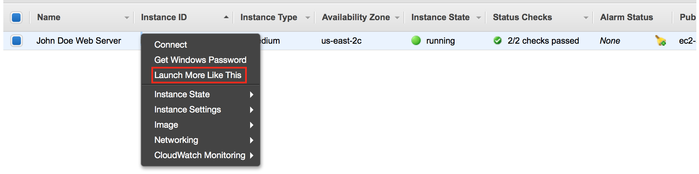
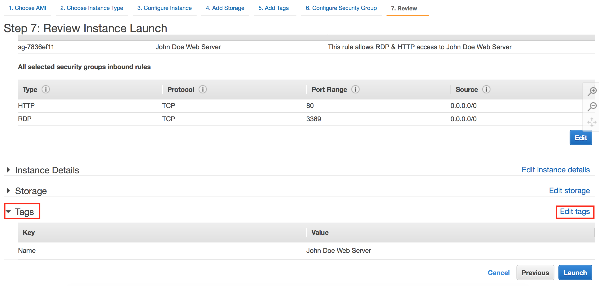
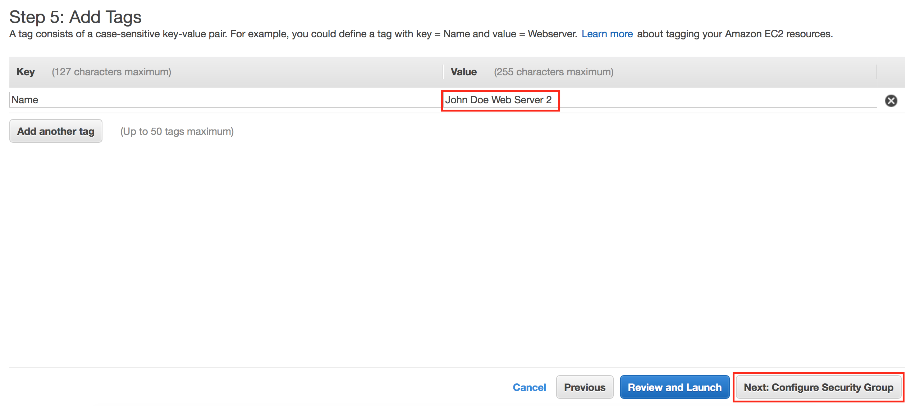
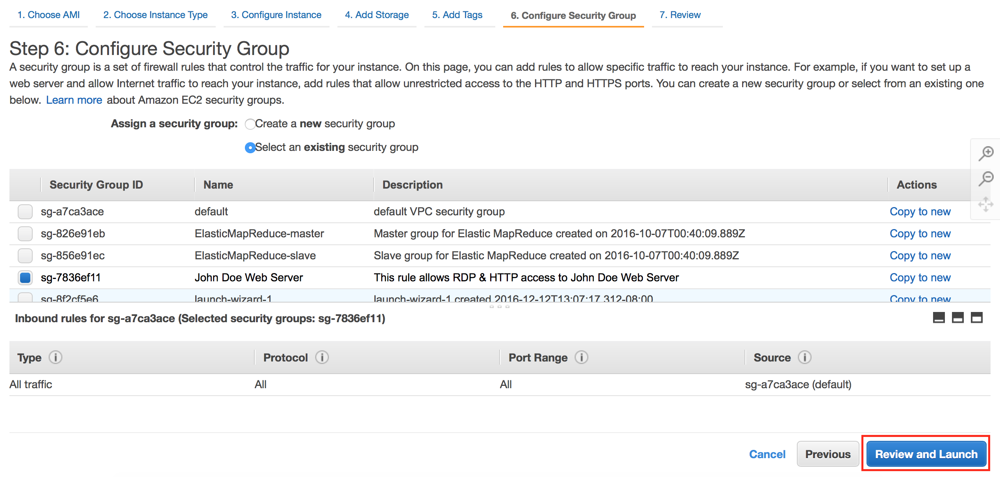
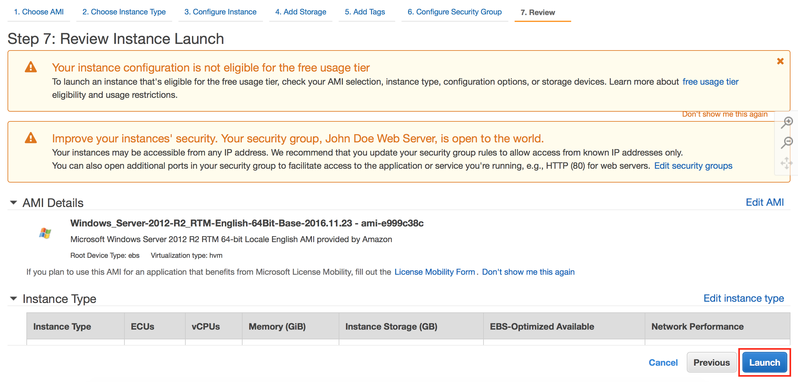
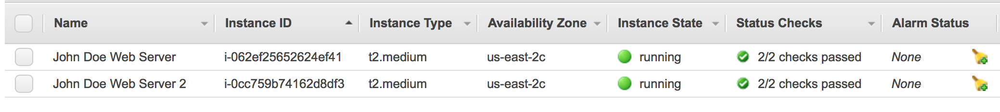
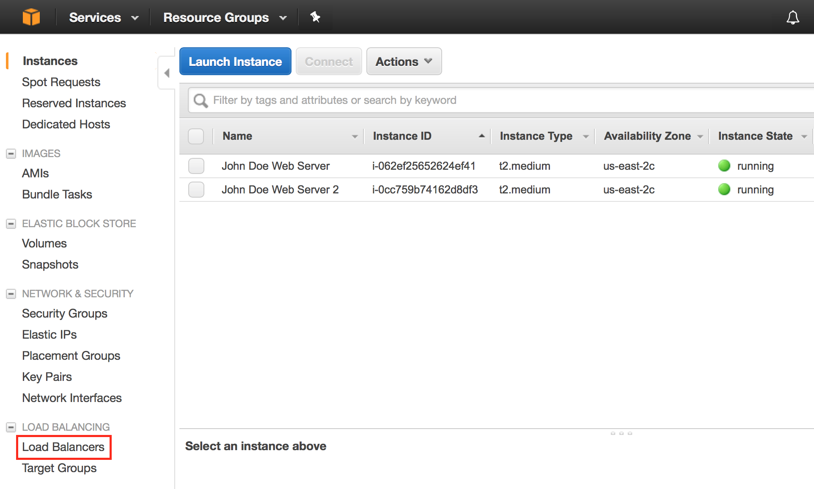
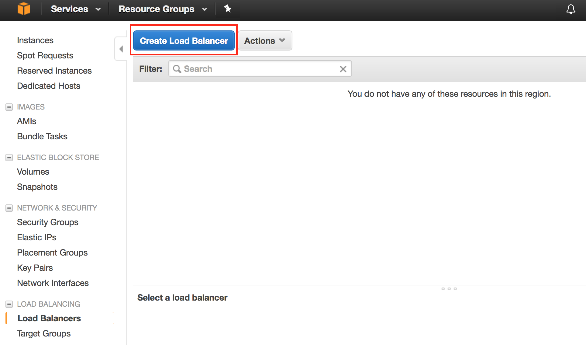

Overview
========

Amazon EC2 Auto Scaling

Amazon EC2 Auto Scaling helps you to maintain application availability
by scaling your infrastructure as the need or demand arises. It helps
support your application's workload by making sure you have the right
number of EC2 instances available. You can create **Auto Scaling
Groups**, which are collections of EC2 instances that have the same
characteristics and applications.

The number of EC2 instances can be scaled in or out as Auto Scaling
responds to the metrics you define when creating these groups.

-   You can specify the **minimum number** of instances in each Auto
    Scaling Group, so that your group never goes *below* this size.

-   You can specify the **maximum number** of instances in each Auto
    Scaling Group, so that your group never goes *above* this size.

-   You can specify a **desired capacity** so that Auto Scaling ensures
    your group always has a certain number of instances.

-   You can specify **scaling policies** so that Auto Scaling will
    modify the desired target capacity mentioned in the previous point.
    It will launch or terminate instances as demand on your application
    increases or decreases.

There are multiple components of Auto Scaling on AWS. They are:

Groups: 
========

> Your EC2 instances are organized into *groups* so that they can be
> treated as a logical unit for the purposes of scaling and management.
> When you create a group, you can specify its minimum, maximum, and
> desired number of EC2 instances. 

Launch Template:
================

> A Launch Template is a capability of EC2 Auto Scaling that allows a
> way to templatize your launch requests. It enables you to store launch
> parameters so that you do not have to specify them every time you
> launch an instance. For example, a launch template can contain an
> Amazon Machine Image, instance type, storage, and networking settings
> that you typically use to launch instances. You can also specify
> advanced configurations like user data, as well as the ability to
> choose T2/T3 Unlimited EC2 instances, where you can decide whether to
> enable applications to burst beyond the baseline CPU performance for
> as long as needed. For each Launch Template, you can create one or
> more numbered Launch Template Versions. Each version can have
> different launch parameters. When you create an Auto Scaling Group
> that is backed by a Launch Template, you also have the option of
> launching one type of instance, or a combination of instance types and
> purchase options.

3.  Scaling Policies:
    =================

    A Scaling Policy tells Auto Scaling when and how to scale. Scaling
    can occur manually, on a schedule, on demand or you can use Auto
    Scaling to maintain a specific number of instances.

    Auto Scaling is well suited for applications that have unpredictable
    demand patterns that can experience hourly, daily, or weekly
    variability in usage. This helps you to manage your cost and
    eliminate over-provisioning of capacity during times when it is not
    needed. Auto Scaling can also find an unhealthy instance, terminate
    that instance, and launch a new one based on the scaling plan

Getting Started

This lab will walk you through the process of building out these
components. For the purposes of this lab, you will be using the AWS
Management Console. Auto Scaling can also be configured from the AWS CLI
or Windows PowerShell if you prefer a command line interface. You can
also do this via an available SDK.

This lab assumes that you have an AWS account and the appropriate
permissions to use the services involved.

Task 1: Creating a Launch Template 
===================================

When you create an Auto Scaling Group, you must specify a Launch
Template. The first step in this lab is to create the Launch Template
for an EC2 Auto Scaling Group.

1.  Sign into the AWS Management Console and on the Services menu, click
    **EC2.**

2.  In the left navigation pane, find AUTO SCALING and click **Auto
    Scaling Groups.**

3.  Click **Create Auto Scaling group.**

> The console explains that the first step is to define a Launch
> Template and the second step is to create the Auto Scaling Group.

4.  Click **Get Started** if prompted.

5.  Select **Launch Template**, and then click **Create a new launch
    template**.

    a.  If you do not see the option to create a Launch Template at this
        step, look for INSTANCES in the left navigation pane and select
        **Launch Templates** to get started instead

6.  This takes you to the *Create launch template* page where you can
    define the following configurations for your launch template:

    b.  **What would you like to do?** Create a new template

    c.  **Launch template name:** scaling-template

    d.  **Template version description:** Launch template for my Auto
        Scaling lab!

7.  Next, select an AMI ID by clicking the **Search for AMI** link to
    the right of this configuration field.

    e.  For the AMI Catalog, select Quick Start

    f.  For the AMI, select the **Amazon Linux AMI**.

> You are selecting an **Amazon Machine Image (AMI),** which provides
> the information required to launch an instance. It is a template for
> the root volume for the instance that can contain an operating system,
> application server, and applications. You use the AMI to launch an EC2
> instance, which is a copy of the AMI running as a virtual server in
> the cloud.

AMIs are available for various versions of Windows and Linux. In this
lab, you are going to launch an instance running *Amazon Linux*.

8.  Next, select the instance type to be **t2.micro**.

> EC2 offers a wide selection of instance types that are optimized to
> fit different use cases. For example, there are memory optimized,
> compute optimized, and storage optimized instances, among others. For
> this lab, you are going to use a t2.micro instance, which is a general
> purpose instance. This instance type is also covered under EC2 Free
> Tier pricing, which includes 750 hours of Linux and Windows t2.micro
> instances each month for one year.

9.  Your configurations up to this point should look like this:

10. Now, you are going to create a security group. Open up the AWS
    Management Console in a new tab and on the Services menu, click
    **EC2.**

11. On the left navigation pane, find NETWORK & SECURITY and select
    **Security Groups.**

12. Click **Create Security** Group and enter the following
    configurations:

    g.  **Security group name:** scaling-lab-sg

    h.  **Description:** Security group for my Auto Scaling lab!

    i.  Add an **Inbound rule** with Type HTTP

> Your final configurations should look like this:

By creating this security group and adding it to your Launch Template,
you are allowing inbound HTTP traffic on port 80 to the EC2 instances in
your Auto Scaling Group so that you can access them through your web
browser.

13. After this, go back to the first tab where you are configuring your
    Launch Template.

14. Hit the refresh button next to Security Groups. Find and select the
    Security Group that you just created.

15. Scroll down to Storage Volumes and select **Add new volume** and
    configure:

    j.  **Device Name:** /dev/xvda

    k.  **Size:** 8

    l.  **Volume type:** General Purpose

    m.  **Delete on termination:** Yes

        In a production environment, you might want to add persistent
        block storage based on your requirements. You can specify an EBS
        volume type, size, and termination requirement. You can also
        enable encryption on the EBS volume.

16. Under Instance Tags, select **Add Tag** and configure:

    n.  **Key:** Name

    o.  **Value:** Scaling Lab Instances

        You can add tags for better organization and management of your
        AWS resources.

17. Your configurations up to this point should look like this:

18. Expand **Advanced details**

    p.  **Monitoring:** Enabled

> Here, you are enabling CloudWatch Detailed Monitoring. By default,
> your instance is enabled for **basic monitoring** with a 5-minute
> period for the instances. You can optionally enable **detailed
> monitoring** for an added cost, however 10 Detailed Monitoring Metrics
> at a 1-minute frequency are covered under the Free Tier. After you
> enable detailed monitoring, the Amazon EC2 console displays monitoring
> graphs with a 1-minute period for the instance. 

q.  Enter the following **user data** as text:

> When you launch EC2 instances, you have the option to pass **user
> data** to the instance which can be used to perform common automated
> configuration tasks and even run scripts after the instance starts.
> Here, you are installing scripts needed for this lab when the instance
> is created and launched.

19. Your final configurations for your Launch Template should be similar
    to this:

    

20. When you are sure the configurations are correct, click **Create
    launch template** and now you are finished creating your Launch
    Template!­­­­­

Task 2: Creating an Auto Scaling Group 
=======================================

You have officially created a Launch Template, which defines *what*
should be launched. Now, it is time to create an Auto Scaling Group so
that you can define *how many* EC2 instances should be launched and
*where* to launch them.

After you finish creating the Launch Template, follow these steps:

21. Go back to the Services menu and click **EC2.**

22. In the left navigation pane, find AUTO SCALING and click **Auto
    Scaling Groups**

23. Click **Create Auto Scaling Group.**

24. Select **Launch Template** and choose the one you have just created.

    
    
25. Click **Next Step.**

26. On the **Configure Auto Scaling group details** page, configure the
    following:

    r.  **Group name:** auto-scaling-lab

    s.  **Fleet composition:** combine purchase options and instances

        This is a feature that lets you create a mixed Auto Scaling
        Group with different instance types as well as different
        purchasing options. This way, you can harness the power of
        multiple EC2 instance types to support your workloads. You can
        also cost optimize by having the option to use On-Demand,
        Reserved, and Spot instances.

    t.  Try adding a new instance type by selecting a different type,
        like t3.micro

    u.  **Group size:** start with 1 instance

    v.  **Network:** keep this the default VPC

    w.  **Subnet:** select the first subnet that appears

27. Expand **Advanced Details.**

    Here you can see further configurations that you can make with your
    Auto Scaling Group, like the ability to associate your group with a
    load balancer. You can use an Elastic Load Balancer with your Auto
    Scaling Group to help automatically distribute incoming application
    traffic across multiple targets, like your EC2 instances. It can
    handle varying load of your application traffic across multiple
    Availability Zones.

> You can use an Elastic Load Balancer with your Auto Scaling Group to
> create a fault tolerant and highly available environment. If you
> associate an Elastic Load Balancer to the Auto Scaling Group, then all
> newly instantiated instances will register themselves with that load
> balancer and then it will distribute incoming traffic across those
> instances. For now, you will leave this unselected and move on.

x.  Select **Enable CloudWatch detailed monitoring** under Advanced
    Details.

<!-- -->

28. Your configurations should be similar to:

29. Select **Next: Configure scaling policies**.

    You are going to skip configuring scaling policies for now. You will
    do this in the next section of the lab.

30. Continue on by selecting **Next: Configure Notifications.**

> You can configure your Auto Scaling Group to send notifications to an
> endpoint that you choose, such as an email address or even an SQS
> Queue or SNS topic, so that you can create automations that work as
> part of your larger workload. You can receive notifications whenever a
> specified event takes place, including the successful launch of an
> instance, failed instance launch, instance termination, and failed
> instance termination.

For now, you are going to skip this step.

31. Click **Next: Configure Tags.**

32. Add a tag and configure the following:

    y.  **Key:** Name

    z.  **Value:** Auto Scaling Group

        

33. Select **Review** and then **Create Auto Scaling group** and now you
    have successfully created your Auto Scaling Group!

Task 3: Creating Scaling Policies
=================================

Now that you have created an Auto Scaling Group, you are going to create
a scaling policy so that your Auto Scaling Group knows when to add
capacity to your applications when they need it, and remove capacity
when they don't.

You can use AWS Auto Scaling to do this. This is a service that monitors
your applications and automatically adjusts capacity to maintain steady,
predictable performance. It offers different built-in scaling strategies
that you can choose from, as well as predictive and dynamic scaling.
Predictive scaling uses machine learning to predict future traffic,
including regularly occurring spikes, and provisions the right number of
EC2 instances in advance of these predicted changes. Dynamic scaling
lets you define how to scale in response to changing demand by using
target tracking, which is a feature that lets you set a target value and
specify a scaling metric.

34. To start, go to the Services menu and select **AWS Auto Scaling**

35. Click **Get Started** if prompted.

36. Under *Find Scalable Resources*, select **Choose EC2 Auto Scaling
    groups** and select the one you have just created.

37. Click **Next** so that you can specify a scaling strategy and
    define:

    a.  **Name:** scaling-plans

> Here you can choose a built-in scaling strategy. There are ones
> optimized for availability, cost, or both. You can also define your
> own custom metrics for optimization. You can also enable predictive
> and dynamic scaling here.

38. Select the **Optimized for availability** strategy

39. Disable predictive scaling for now and leave the rest of the
    configuration details the same

> The default settings are configured to maintain an average CPU
> utilization of 40%. Your resources will scale in and out as needed to
> achieve this.

40. Hit next twice and create the scaling plan. You have successfully
    created your scaling strategy!

Task 4: Testing the Auto Scaling Group 
=======================================

Now that you have created your Auto Scaling Group and scaling strategy,
you can test it to ensure that it works correctly.

41. Hit **Close** to return back to the Auto Scaling Groups page under
    Auto Scaling listed in the navigation pane on the left.

42. Select the Auto Scaling Group you have just created.

> This brings up details about your Auto Scaling Group, like the active
> history, scaling policies, instances, and allows you to monitor
> different metrics.

43. Select the **Instances** tab to see that your Auto Scaling Group is
    in the process of spinning up an EC2 instance, as shown below.

44. Select the **Instance ID**, which will take you to the EC2
    Management Console.

    On this page, you can see details about specific EC2 instances, like
    the public DNS name, IPv4 address, and status checks. Since you have
    enabled detailed monitoring, you can also monitor metrics at a
    1-minute interval under the **Monitoring** tab. These metrics
    include CPU utilization, disk reads, disk writes, and much more.

45. Wait for the instance state to say running and status checks to say
    2/2 before moving forward.

46. Copy the **Public DNS** name.

47. Open a new tab in your web browser and go to that public DNS name.
    You should see this:

48. Click **Generate Load**. You might have to do this a couple times to
    ensure you are keeping a constant load on your instance.

> Now that you are maxing out the load on that EC2 instance to 100%,
> your Auto Scaling Group should respond by spinning up more instances
> to help support the increase in load.

49. Go back to the EC2 console, make sure your instance is selected, and
    click the **Monitoring** tab so you can see CloudWatch detailed
    monitoring metrics.

> It will take a minute for data to start populating in CloudWatch.
> Since you are maxing out the load on your EC2 instance, your CPU
> utilization should look similar to this:

> You can also view metrics in the AWS Auto Scaling page if you select
> your scaling plan:

> Based on the scaling policy you have set in your Auto Scaling Group,
> your group should spin up a new instance to help support this increase
> in demand.
>
> This might take a couple of minutes. Refresh the EC2 instances page
> and you should soon see a new instance spinning up automatically.

> You can also see this in the Auto Scaling Group page. If you look at
> the details under the Active History tab, you can see that the new
> instance is warming up. You can look at the Instances tab to see how
> many instances there are in your group currently. The monitoring tab
> shows you different metrics like group size, pending instances, total
> instances, and much more.

Congratulations! You have successfully created an EC2 Auto Scaling
Group!

Task 5: Clean Up 
=================

Now that you have successfully created your Auto Scaling Group and
tested it to ensure that it works, you can clean up your environment by
spinning down these resources.

50. First, delete your Auto Scaling Group by selecting your group,
    hitting **Actions**, and then **Delete**.

Deleting your Auto Scaling Group also deletes all the EC2 instances
associated with it.

51. Finally, delete your Launch Template by going to the Launch
    Templates in the left navigation pane, selecting the template,
    hitting **Actions,** and then **Delete.**

Appendix -- Additional Reading
==============================

What is Amazon EC2 Auto Scaling?

<https://docs.aws.amazon.com/autoscaling/ec2/userguide/what-is-amazon-ec2-auto-scaling.html>

What is Elastic Load Balancing?

<https://docs.aws.amazon.com/elasticloadbalancing/latest/userguide/what-is-load-balancing.html>

What is Amazon VPC?

<https://docs.aws.amazon.com/vpc/latest/userguide/what-is-amazon-vpc.html>

Whitepaper: Building Fault-Tolerant Applications on AWS

<https://media.amazonwebservices.com/AWS_Building_Fault_Tolerant_Applications.pdf>
