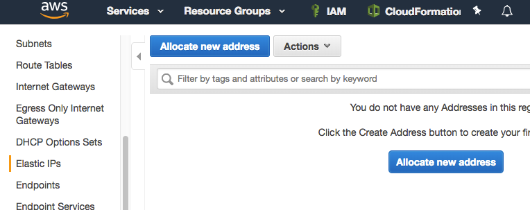
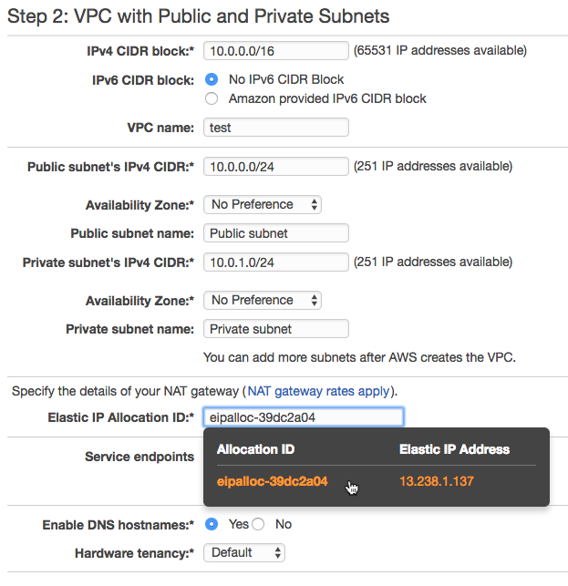

{width="3.1972222222222224in"
height="1.7090277777777778in"}

Overview
========

This lab will walk the user through creating an ALB to load balance
traffic across several EC2 nodes in a single Availability Zone.

> {width="1.0in" height="1.0in"}This lab has a
> prerequisite of Immersion Day -- Getting Started with EC2 and assumes
> that you have already launched your first web server. This lab will
> demonstrate configuring a farm of web servers to use ALB for its load
> balancing needs.

 

 Launch a Second Web Server
==========================

Let's launch another web server, similar to our existing web server
instance.

1.  {width="7.0in"
    height="1.7451388888888888in"}Right click your web server and choose
    **Launch More Like This**. As it implies, this feature will launch
    another web server similar to the existing web server.

    (Please note that launch more like this does not clone the instance.
    It only replicates configuration details so any webserver
    configuration on the intance will need to be supplied via AMI or
    user data. For more details, please check the reference in the end
    of the document )[^1]

2.  On the next screen, scroll down to the **Tags** section and click
    **Edit Tags**.

    {width="7.0in" height="3.347916666666667in"}

3.  Change the **Value** of the **Name** tag to something different than
    the first instance, like \[Your name\] Webserver 2. Click **Next:
    Configure Security Group**

    {width="7.0in" height="3.127083333333333in"}

4.  {width="7.0in"
    height="3.345833333333333in"}Click the **Review and Launch** button
    to continue to the next screen where you'll launch the additional
    server.

5.  Click on **Launch** to launch your additional instance. Like your
    first instance, this newly launched instance will take a few minutes
    to boot and configure itself.

{width="7.0in" height="3.3569444444444443in"}

6.  Please select the existing key pair that you created and click
    Launch Instances.

    {width="5.175930664916885in"
    height="2.881165791776028in"}

7.  Once the second web server has passed its status checks, confirm the
    web server is operational by browsing to its web site using its
    public DNS. You'll see both instances listed in your console as
    shown below.

{width="7.0in" height="0.7881944444444444in"}

Create an ALB
=============

You now have two web servers, but you need a load balancer in front of
these servers to give your users a single location for accessing both
servers and to balance user requests across your web server farm.

1.  {width="7.0in"
    height="4.2131944444444445in"}Click on the **Load Balancers** link
    in the EC2 Console.

2.  Click on **Create Load Balancer** button.

> {width="5.68125in"
> height="3.341666666666667in"}

3.  We will be creating a Application Load Balancer today, so please
    select that option and click **Continue** to proceed to the next
    step.

> {width="7.0in" height="2.1034722222222224in"}

4.  For the load balancer name, type a name like \[YourName\]-ALB, keep
    scheme as "internet-facing", and IP address type as "ipv4". Verify
    that HTTP is selected for the load balaner protocol with load
    balancer port 80. Select the VPC and subnet where the web server is
    running in, then click **Next: Assign Security Groups**.

    *Note: Please note that spaces are not allowed in the ALB name.*

    {width="7.0in"
    height="3.1631944444444446in"}

5.  On the next screen, it shows the load balancer is not using secure
    listener. In production environment it is recommended to use HTTPS
    protocol for front-end connection. In this lab, we will skip that
    part. Click **Next: Configure Security Groups.**

6.  On the next screen we'll create a new security group for our ALB.
    Name your security group something like **\[Your Name\] ALB SG,**
    and allow HTTP traffic to be passed to your instances by creating a
    rule of type **HTTP** for port 80, then click **Next:Configure
    Routing**.

    {width="7.0in" height="3.1375in"}

7.  On the next screen you will configure the target group and health
    check. Name the target group like something **\[Your
    Name\]targetgroup,** then select target type as Instance. Keep
    Protocols and Port as default(HTTP & 80) Verify health checks
    protocol is HTTP and Path is /. Then click **Next:Register
    Targets.**

    *Note: Please note that spaces are not allowed in the Target group
    name.*

    {width="7.0in"
    height="3.0118055555555556in"}

8.  Select both your Web Servers you created and click **Add to
    registered** to add them to your ALB and click **Next:Review**.

    {width="7.0in"
    height="3.0145833333333334in"}

9.  Review your ALB settings and click **Create** (followed by clicking
    **Close**).

    {width="7.0in"
    height="2.9965277777777777in"}

10. AWS is now creating your ALB. It will take a couple of minutes to
    establish your load balancers, attach your web servers, and pass a
    couple of health checks. **Click** on your load balancer, once the
    State is showing active, **Click** target Groups *and* then select
    Targets tab, you should see both of your web servers are
    healthy**.**

{width="7.0in" height="3.0881944444444445in"}

11. Switch back to Load Balancers, Under the Description tab, copy the
    ALB's DNS name.

{width="7.0in" height="3.147222222222222in"}

12. Open the ALB URL in a new browser tab. Hit the browser refresh
    button and you should cycle through your web servers (you may need
    to do a "Shift-F5" or "Shift-Refresh" as some browsers like Chrome
    are pretty aggressive in locally caching web pages).

> {width="5.394365704286964in"
> height="1.4829155730533683in"}{width="5.309858923884515in"
> height="1.4786482939632546in"}

13. Congratulations, you've created a load balanced website.

[^1]: https://docs.aws.amazon.com/AWSEC2/latest/UserGuide/launch-more-like-this.html
