### Lab 6: Simple Storage Service (S3) Hands-On Lab

Amazon S3 Overview
==================

Amazon Simple Storage Service (S3) provides a simple web services
interface that can be used to store and retrieve any amount of data, at
any time, from anywhere on the web. This lab is designed to demonstrate
how to interact with S3 to store, view, move and delete objects.

This lab will walk you through the following:

-   Creating a bucket in S3

-   Adding an object to the S3 bucket

-   View the object in S3

-   Move the object in S3

-   Enable bucket versioning

-   Delete the object and the bucket in S3

Create a Bucket in S3
=====================

Every object in Amazon S3 is stored in a bucket. Before you can store
data in Amazon S3 you must create a bucket.

***Note:** You are not charged for creating a bucket; you are only
charged for storing objects in the bucket and for transferring objects
in and out of the bucket.*

1.  Sign into the AWS Management Console and open the Amazon S3 console
    at
    [[https://console.aws.amazon.com/s3]{.underline}](https://console.aws.amazon.com/s3).

2.  Click **Create Bucket**. The **Create a Bucket** dialog box appears.

    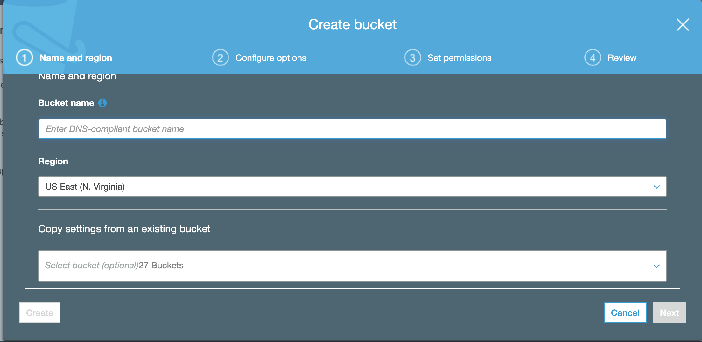

3.  Enter a bucket name in the **Bucket Name** field. The bucket name
    you choose must be unique across all existing bucket names in Amazon
    S3. One way to do that is to prefix your bucket names with your
    organisation\'s name. 


Bucket names must comply with the following requirements.

Bucket names:

-   Can contain lowercase letters, numbers, periods (.) and dashes (-)

-   Must start with a number or letter

-   Must be between 3 and 255 characters long

-   Must not be formatted as an IP address (e.g., 265.255.5.4)

***Note:** There might be additional restrictions on bucket names based
on the region your bucket is in or how you intend to access the object.
Once you create a bucket, you cannot change its name. In addition, the
bucket name is visible in the URL that points to the objects stored in
the bucket. Make sure the bucket name you choose is appropriate.*

4.  In the **Region** drop-down list box, select a region. Click
    **Next**.

5.  You also have the option of copying settings from an existing bucket

6.  Under **Tags**, in the **Key** box, type **Purpose**, and in the
    **Value** box, enter **Immersion Day**.

7.  Have a good look at the other options, but leave them as default for
    this lab. Click
    **Next**.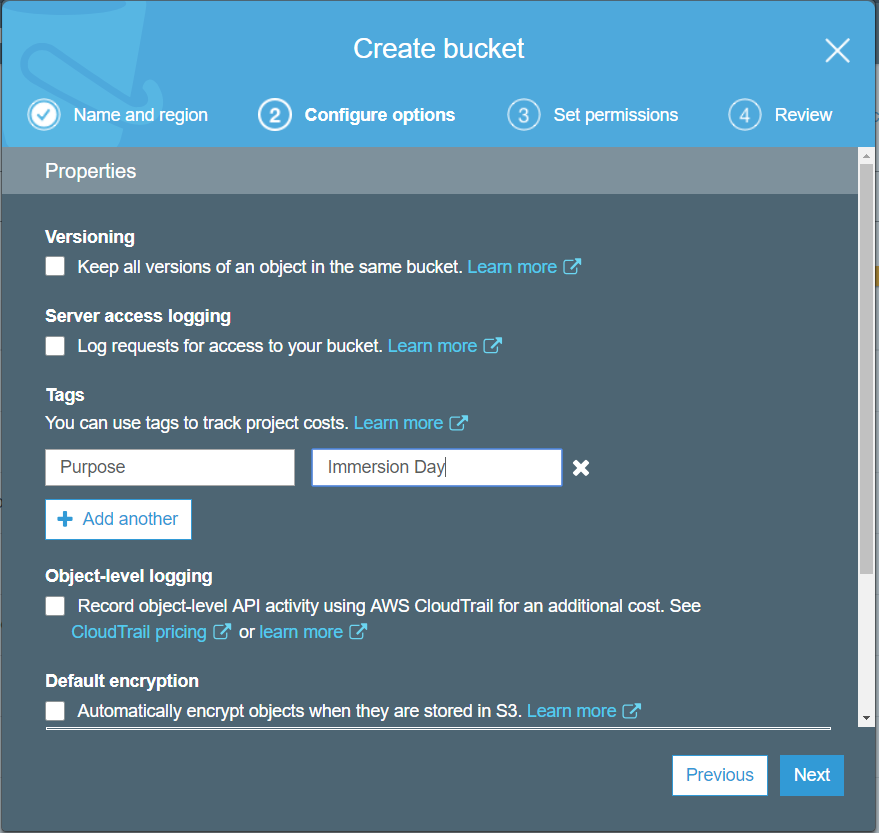

8.  Under set permissions. We will block public access to the bucket

    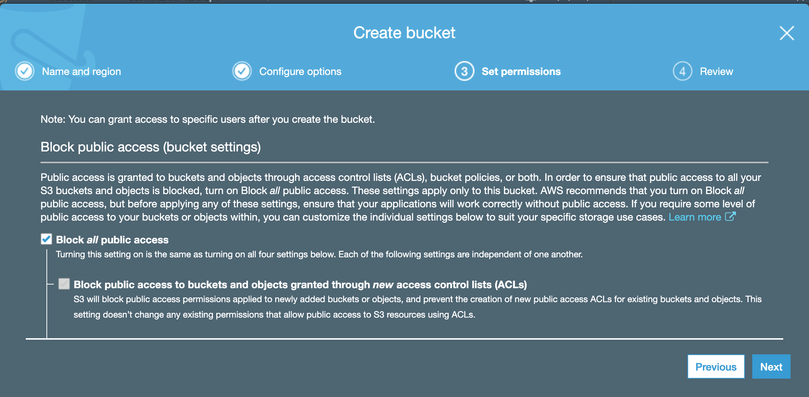

9.  Click on next

10.  Finally, review your settings and click **Create bucket**. When
    Amazon S3 successfully creates your bucket, the console displays
    your empty bucket in the **Buckets** panel.

    

**Well done - you\'ve created your first bucket in Amazon S3!**

Add an Object to a Bucket
=========================

Now that you\'ve created a bucket, you\'re ready to add an object to it.
An object can be any kind of file: a text file, a photo, a video and so
forth. When you add a file to Amazon S3, you have the option of
including metadata with the file and setting permissions to control
access to the file.

1.  In the Amazon S3 console, click the on the name of the bucket to
    which you want to upload an object (not the bucket icon itself,
    though), and then click **Upload** in the **Objects** tab. The
    **Upload** dialogue opens (its appearance may differ slightly
    between different browsers).

2.  Click **Add Files** to select a file to upload. A file selection
    dialog box opens.

    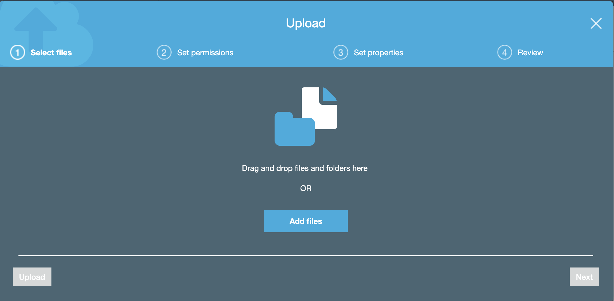

3.  Select a small file to upload and click **Open**. The **Upload**
    dialogue shows the files and folders you\'ve selected to upload.

4.  Use the default permissions

    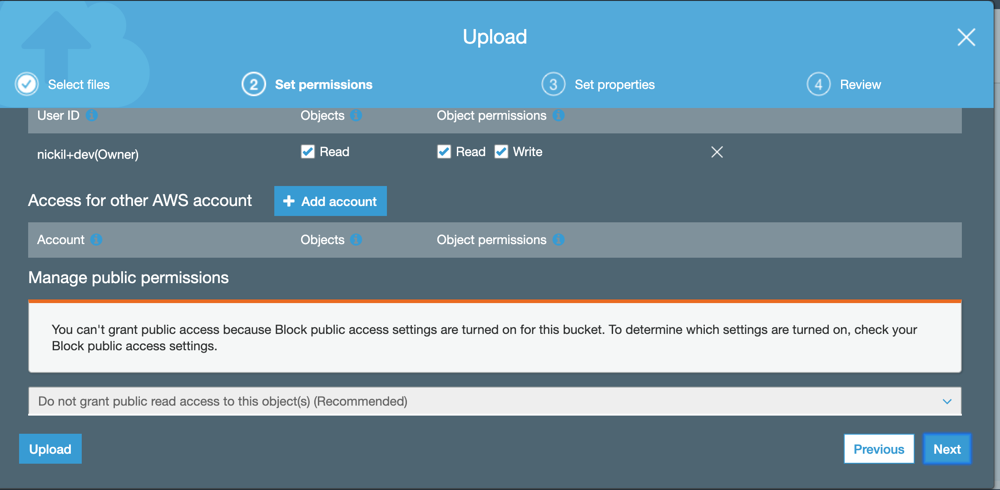

5.  For the purpose of this lab we will be using the standard tiering
    option. Depending on your use case you can choose other tiering
    options

    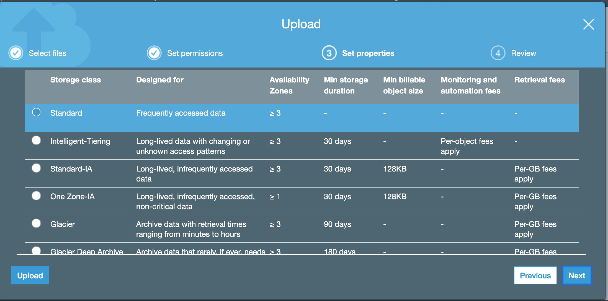

<!-- -->

6.  Click **Upload**. You can watch the progress of the upload at the
    bottom of the screen. This appears as soon as the upload begins.

> **Good work - you\'ve added a file to your bucket!**

View an Object
==============

Now that you\'ve added an object to a bucket, you can open and view it
in a browser.

1.  In the Amazon S3 console, click the on the name of the object you
    want to open.

***Note:** By default, your Amazon S3 buckets and objects are private.
To view an object using a URL, for example,
https://s3.amazonaws.com/Bucket/Object the object must be publicly
readable. Otherwise, you will need to create signed URL that includes a
signature with authentication information. You can optionally save the
object locally.*

2.  Click on the **Permissions**. **Uncheck** the block all public
    access

    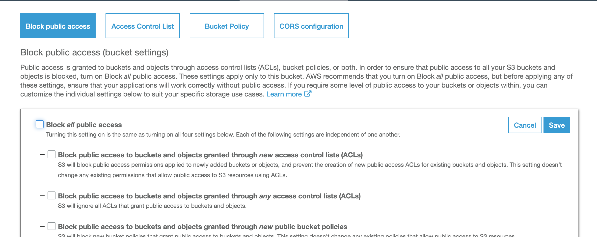

3.  Type in **confirm**

    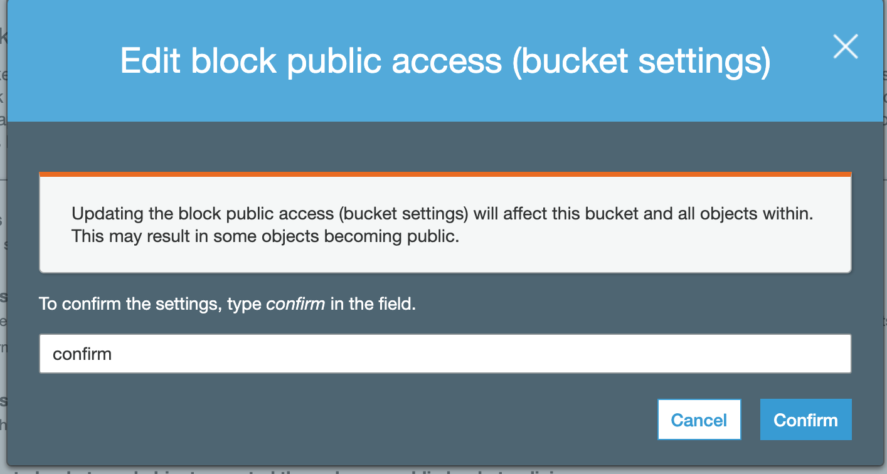

4.  Click on overview. Navigate to the object in your bucket. Click on
    permissions

    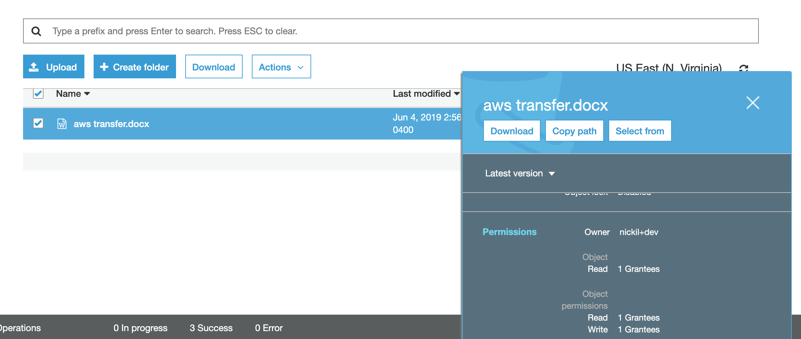

5.  Scroll down and click on **Everyone** and **check** read object. You
    should see the following message pop up

    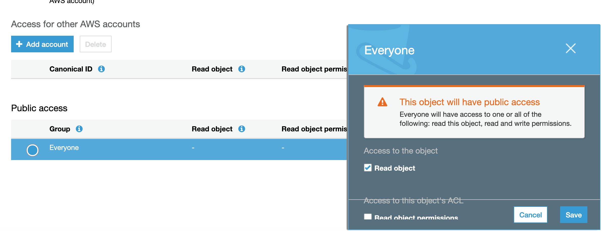

6.  Click on the **Overview** tab, and then click on the link to your
    object at the bottom of the screen to view the file using your
    browser.

**Good job - you\'ve retrieved your object from S3 via the web!**

Move an Object
==============

Now that you\'ve added an object to a bucket and viewed it, you might
like to move the object to a different bucket or folder.

1.  In the Amazon S3 console, create a new bucket (reference earlier
    section for details).

2.  Select the first bucket you created and view the list of objects.

3.  Select the object(s) you want to move by clicking the selection box
    to their left. You can ignore the info box that opens when you
    select an object.

4.  Once you've selected your files, click on the **More** button, and
    then click **Cut**.

5.  Navigate to the target bucket (and folder, if applicable) to which
    you want to move the object, click the **More** button and then
    click **Paste**. At the **Cut and paste** review dialogue, confirm
    the action by clicking **Paste**.

***Note: When you move an object across buckets the previously set
object permissions will persist by default.***

**Congratulations - you have now moved an object between buckets.**

Enable Bucket Versioning
========================

If you want to add new version of the object to the same bucket but want
to retain the old version, you can turn on bucket versioning.

1.  In the S3 Console, click on the link representing the bucket you
    created, and then select the **Properties** tab.

    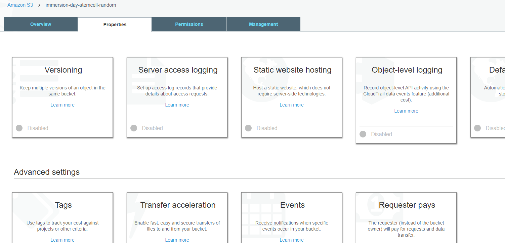

2.  Click on the **Versioning** tile, select the **Enable versioning**
    radio button, and then click **Save**.

3.  Choose an object that you are able to edit on your computer, and
    upload it using the steps from the **Add an Object to a Bucket**
    section above.

4.  Now open the original file on your computer and edit it, saving the
    updated version under the **same file name**.

5.  Upload this updated file to the S3 bucket in the same way as before.

6.  Now click on the object's link in the S3 bucket and click on the
    words **Latest version** (to the right of the object's name).

    

This shows the different versions of the object in the bucket. You can
click on the **download** icon and view the different versions of the
object.

Delete an Object and Bucket
===========================

You've added an object to a bucket, viewed it, and moved it. Now, you
can delete it and the bucket it\'s in.

If you no longer need to store the objects you uploaded and moved while
going through this guide, you should delete them so you do not incur
further charges on those objects.

1.  **I**n the Amazon S3 console, click on the link representing the
    bucket containing the object(s) you want to delete. Then select the
    object(s).

2. Click the **More** button, followed by **Delete**. To confirm the
    action in the **Delete objects** dialogue, click **Delete**.

3. Navigate back to the S3 console and select the bucket icon of the
    bucket you want to delete (not the link to its right), and at the
    top of the page, click **Delete bucket**. Confirm the deletion by
    typing its name verbatim at the **Delete bucket** prompt.

**Well done, your bucket is now deleted!**

Conclusion
==========

In this lab you have learned the basic operations to manage the
lifecycle of an S3 object. First, you created a bucket, which is the
logical container of objects. Then by uploading, viewing, moving an
object, and enabling versioning, you learned the basic operations of the
object itself. Finally, you learned how to delete both an object and a
bucket.

You should continue exploring more features of S3!

-   *Did you know you can host a website entirely on S3?*

-   *Did you know you can define automated lifecycle policies?*

-   *How about fine-grained access control with Bucket Policy?*
